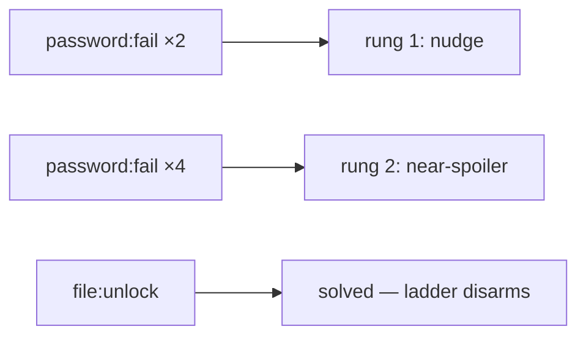
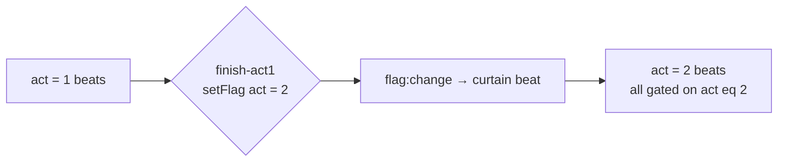
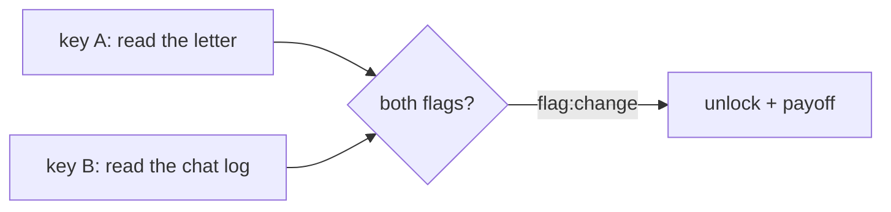
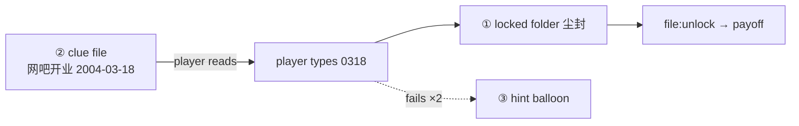
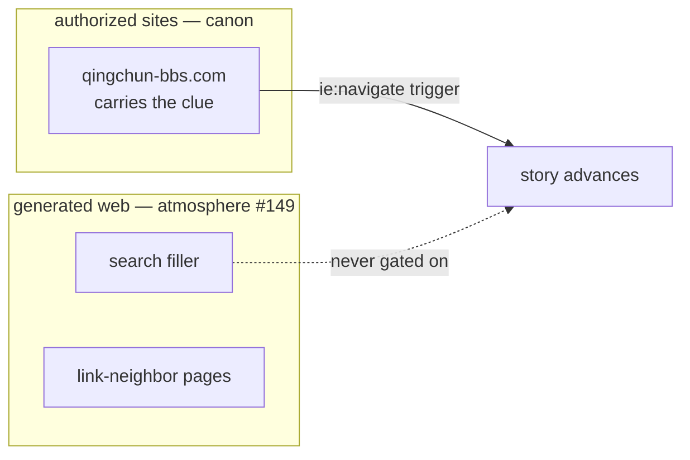
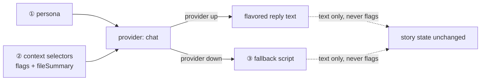
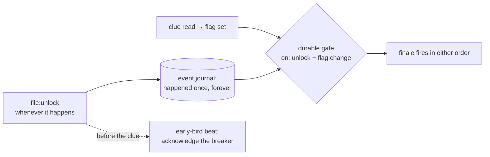
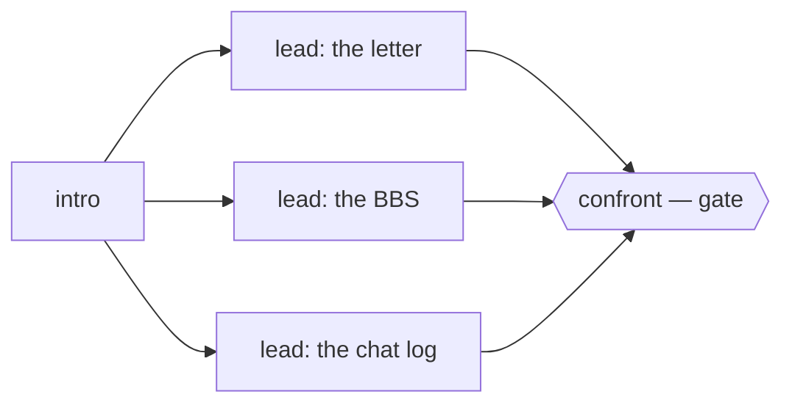

# Scenario pattern library (#239)

Recurring, named recipes for scenario and content-pack authoring — the corpus
both human authors and AI assistants draft from. Each pattern states its
**intent**, shows the **structure**, gives a **copyable recipe**, and names the
**anti-pattern** that breaks it. The semantics reference is
[`SCENARIOS.md`](./SCENARIOS.md); the design rationale behind each mechanic is
[`PUZZLE-DESIGN.md`](./PUZZLE-DESIGN.md); the guided authoring workflow is the
repo skill [`.claude/skills/scenario/`](../.claude/skills/scenario/SKILL.md).

## How this document stays honest (CI contract)

The governing principle of AI-assisted authoring is **"AI drafts, deterministic
tools adjudicate"** — and the pattern library itself is held to it:

- Every fenced <code>```json</code> block in this file is a **complete,
  self-contained scenario or content pack**. CI extracts each block and runs the
  real adjudicator (`xp-scenario lint`) over it — `npm run patterns:check`,
  wired into `npm run scenario:ci`. The library is held to a stricter bar than
  user scenarios: **zero errors *and* zero warnings**. A snippet that stops
  linting clean fails the build, so the library cannot rot as the schema/event
  catalog evolves.
- Fenced <code>```jsonc</code> blocks are **illustrative fragments and
  anti-examples** — they carry comments, may be deliberately wrong, and are
  *not* linted. Never copy a `jsonc` block as-is.

When you add a pattern: write the recipe as strict JSON, keep it minimal but
complete, then run `npm run patterns:check` before committing.

## The five outlets (house rule)

Draft time is a routing problem: every piece of content has exactly one right
home. Putting it anywhere else is drift the toolchain can't defend.

| # | Content kind                                      | Outlet                                                              |
| - | ------------------------------------------------- | ------------------------------------------------------------------- |
| ① | **Logic** — gating, flags, triggers, puzzle graph | the scenario JSON (`triggers` / `PuzzleGraph`)                      |
| ② | **Large content** — fake webpages, long docs, media | files behind `ContentRef` (`assets` manifest + `{ asset }` refs)  |
| ③ | **Beat text** — dialogue, balloons, notes         | per-culture `strings` tables (#207), referenced via `*Key` fields   |
| ④ | **AI-buddy definitions** — persona / context / fallback | the `provider: "chat"` branch inside scenario data (#148)     |
| ⑤ | **Era prompt templates** — generated-web tone     | the culture package corpus (`culture.webContent`, #149)             |

The scenario JSON ends up holding only logic; everything else is referenced.

---

# Part I — Story patterns (scenario logic)

## Pattern 1 — the hint ladder（提示阶梯, M12）

**Intent.** The anti-stuck contract: when the player flails (repeated password
failures) or stalls (idle periods), escalate hints — cheap nudge first, near-spoiler
last. Every critical-path puzzle must carry one; the puzzle-graph linter
*errors* on a `gate` node without hints.

**Structure.**



**Recipe.** In graph authoring prefer `ladderKeys({ fails: 2 }, 'k1', 'k2')` —
it compiles to exactly this shape. Hand-written Layer-1 form:

```json
{
  "id": "pattern-hint-ladder",
  "strings": {
    "zh": {
      "hint.title": "提示",
      "hint.1": "线索就在你已经打开过的东西里。",
      "hint.2": "聊天记录里提到的那个日期——就是密码。"
    },
    "en": {
      "hint.title": "Hint",
      "hint.1": "The clue is in something you already opened.",
      "hint.2": "The date mentioned in the chat log — that is the password."
    }
  },
  "triggers": [
    {
      "id": "solved",
      "on": "file:unlock",
      "when": { "event": { "name": "私人" } },
      "once": true,
      "do": [{ "setFlag": "folder_open" }]
    },
    {
      "id": "hint-rung-1",
      "on": "password:fail",
      "when": {
        "all": [
          { "not": { "flag": "folder_open" } },
          { "count": { "type": "password:fail", "match": { "name": "私人" } }, "gte": 2 }
        ]
      },
      "once": true,
      "do": [{ "notify": { "titleKey": "hint.title", "bodyKey": "hint.1", "timeout": 10000 } }]
    },
    {
      "id": "hint-rung-2",
      "on": "password:fail",
      "when": {
        "all": [
          { "not": { "flag": "folder_open" } },
          { "count": { "type": "password:fail", "match": { "name": "私人" } }, "gte": 4 }
        ]
      },
      "once": true,
      "do": [{ "notify": { "titleKey": "hint.title", "bodyKey": "hint.2", "timeout": 10000 } }]
    }
  ]
}
```

Points that make it a ladder, not a faucet: each rung is `once`, each rung is
gated `not(solved)` so hints stop the moment the door opens, and the `match`
narrows the count to *this* lock so failures elsewhere don't leak in.

**Anti-pattern.** A hint that never disarms — omitting the `not` guard lets the
balloon fire after the puzzle is solved (a count predicate stays ≥ 2 forever):

```jsonc
{
  "on": "password:fail",
  // ✗ no "not solved" guard, no once — spams forever, even post-solve
  "when": { "count": { "type": "password:fail" }, "gte": 2 },
  "do": [{ "notify": { "body": "……" } }]
}
```

## Pattern 2 — the act gate（幕间门）

**Intent.** A story bottleneck: everything in act 2 stays inert until the
player crosses one authored threshold. One `act` flag carries the story's
coarse position; every act-scoped trigger checks it; the curtain-rise beat
listens for the flag *change* itself.

**Structure.**



**Recipe.**

```json
{
  "id": "pattern-act-gate",
  "initialFlags": { "act": 1 },
  "strings": {
    "zh": { "act2.title": "第二幕", "act2.body": "D 盘多了一个能打开的文件夹。" },
    "en": { "act2.title": "Act Two", "act2.body": "A folder on the D: drive can be opened now." }
  },
  "triggers": [
    {
      "id": "finish-act1",
      "on": "file:open",
      "when": { "all": [{ "flag": "act", "eq": 1 }, { "event": { "name": "日记.txt" } }] },
      "once": true,
      "do": [{ "setFlag": "act", "value": 2 }]
    },
    {
      "id": "act2-curtain",
      "on": "flag:change",
      "when": { "event": { "flag": "act", "value": 2 } },
      "once": true,
      "do": [
        { "notify": { "titleKey": "act2.title", "bodyKey": "act2.body" } },
        { "unlock": ["我的电脑", "本地磁盘 (D:)", "第二幕"] }
      ]
    },
    {
      "id": "act2-beat",
      "on": "file:open",
      "when": { "all": [{ "flag": "act", "eq": 2 }, { "event": { "name": "线索.txt" } }] },
      "once": true,
      "do": [{ "setFlag": "act", "value": 3 }]
    }
  ]
}
```

The `flag:change` trigger (#207) fires only on a *real* change, so the curtain
can't loop; separating "cross the threshold" from "raise the curtain" keeps the
transition in one place even when several paths can finish act 1.

**Anti-pattern.** Gating act-2 beats on the *event that ended act 1* instead of
the act flag — any second path into act 2 (a debug seek, an added shortcut
puzzle) silently strands every downstream beat. Gate on state, not on history.

In graph authoring, mark the bottleneck with `gate: true` instead — the linter
then *warns about puzzles that bypass it* and *errors if it lacks a hint ladder*.

## Pattern 3 — the double-key door（双钥匙门）

**Intent.** A convergence point: two independent discoveries (in either order)
are both required to open one door. Classic PDC "bushiness" — the player has
two live leads, and the door opens the moment the second key lands.

**Structure.**



**Recipe.**

```json
{
  "id": "pattern-double-key",
  "strings": {
    "zh": { "door.title": "咔哒", "door.body": "两条线索对上了——那个文件夹的密码有眉目了。" },
    "en": { "door.title": "Click", "door.body": "The two clues line up — you can guess that folder's password now." }
  },
  "triggers": [
    {
      "id": "key-a",
      "on": "file:open",
      "when": { "event": { "name": "旧信.txt" } },
      "once": true,
      "do": [{ "setFlag": "key_letter" }]
    },
    {
      "id": "key-b",
      "on": "file:open",
      "when": { "event": { "name": "聊天记录.txt" } },
      "once": true,
      "do": [{ "setFlag": "key_chatlog" }]
    },
    {
      "id": "door-opens",
      "on": "flag:change",
      "when": { "all": [{ "flag": "key_letter" }, { "flag": "key_chatlog" }] },
      "once": true,
      "do": [
        { "unlock": ["我的电脑", "本地磁盘 (C:)", "尘封"] },
        { "notify": { "titleKey": "door.title", "bodyKey": "door.body" } }
      ]
    }
  ]
}
```

Listening on `flag:change` (not on the key events) is what makes the door
order-independent: whichever key lands second raises the door, and adding a
third key later means touching only the `when`. This works because both keys
are *flags* — durable state. When one "key" is a raw event (an unlock, a
navigation) rather than a flag you set, the same idea needs the `happened`
journal predicate — see Pattern 12 (the order-independent gate).

**Anti-pattern.** Putting the unlock inside *both* key triggers, each checking
the other's flag — two copies of the payoff to keep in sync, and a third key
means editing three triggers. Convergence logic belongs in one trigger.

## Pattern 4 — the idle nudge（发呆推动）

**Intent.** The player has stalled — not failing, just idle. A buddy pings, a
balloon points somewhere. Bounded (`max`) so care doesn't become nagging, and
disarmed once the beat it protects is done.

**Recipe.**

```json
{
  "id": "pattern-idle-nudge",
  "strings": {
    "zh": { "nudge.text": "在吗？卡住的话，看看回收站——有些东西删了还在。" },
    "en": { "nudge.text": "You there? If you're stuck, check the Recycle Bin — deleted isn't gone." }
  },
  "triggers": [
    {
      "id": "found-it",
      "on": "file:restore",
      "when": { "event": { "name": "写给未来的信.txt" } },
      "once": true,
      "do": [{ "setFlag": "letter_restored" }]
    },
    {
      "id": "idle-nudge",
      "on": "user:idle",
      "when": { "not": { "flag": "letter_restored" } },
      "max": 3,
      "do": [{ "qqMessage": { "buddyId": "crystal", "textKey": "nudge.text" } }]
    }
  ]
}
```

`user:idle` fires per idle period (#130), so `max: 3` means at most three
nudges per save — give any bounded trigger a stable `id` so the persisted fire
count survives rulebook edits.

**Anti-pattern.** An unbounded, unguarded `user:idle` trigger. It fires on
every idle period for the lifetime of the save — including after the story is
over — and trains the player to ignore the channel. Escalation across several
idle periods belongs to the hint ladder (Pattern 1, `ladder({ idles: 1 }, …)`),
not to one trigger repeating the same line.

## Pattern 5 — looping buddy chatter（循环好友闲聊）

**Intent.** Ambient life: a buddy answers *something* whenever the player
messages them, cycling through a small pool of lines, without ever advancing
the story. Progress never depends on it.

**Structure.** A counter flag walks 0 → 1 → 2 → 0; each line owns one counter
value. **Declare the triggers in *reverse* counter order** — within one event,
later triggers see flag changes made by earlier ones (see
[`SCENARIOS.md` § Trigger order](./SCENARIOS.md#trigger-order--flag-cascades)),
so ascending order would dump the whole pool in a single reply.

**Recipe.**

```json
{
  "id": "pattern-buddy-chatter",
  "initialFlags": { "chatter_i": 0 },
  "strings": {
    "zh": {
      "chat.0": "刚下副本，累死了[困]",
      "chat.1": "你那边天气怎么样？",
      "chat.2": "等我攒够钱就去买那块显卡！"
    },
    "en": {
      "chat.0": "Just got out of a raid, exhausted [sleepy]",
      "chat.1": "How's the weather over there?",
      "chat.2": "Once I save up I'm buying that graphics card!"
    }
  },
  "triggers": [
    {
      "id": "chatter-2",
      "on": "qq:reply",
      "when": { "all": [{ "event": { "buddyId": "zhe" } }, { "flag": "chatter_i", "eq": 2 }] },
      "do": [
        { "qqMessage": { "buddyId": "zhe", "textKey": "chat.2" } },
        { "setFlag": "chatter_i", "value": 0 }
      ]
    },
    {
      "id": "chatter-1",
      "on": "qq:reply",
      "when": { "all": [{ "event": { "buddyId": "zhe" } }, { "flag": "chatter_i", "eq": 1 }] },
      "do": [
        { "qqMessage": { "buddyId": "zhe", "textKey": "chat.1" } },
        { "setFlag": "chatter_i", "value": 2 }
      ]
    },
    {
      "id": "chatter-0",
      "on": "qq:reply",
      "when": { "all": [{ "event": { "buddyId": "zhe" } }, { "flag": "chatter_i", "eq": 0 }] },
      "do": [
        { "qqMessage": { "buddyId": "zhe", "textKey": "chat.0" } },
        { "setFlag": "chatter_i", "value": 1 }
      ]
    }
  ]
}
```

When the pool has no story-state dependence at all, prefer the data-side loop —
a QQ buddy's `reply: { "kind": "script", "steps": [...] }` cycles automatically
with zero triggers. Use the scenario-side loop only when the chatter must react
to flags (a different pool per act, a line that appears after a discovery).

**Anti-pattern.** Declaring the three triggers in ascending order — one
`qq:reply` cascades through all of them (0→1 fires, then the eq-1 trigger sees
the *new* value and fires too…) and the buddy dumps the entire pool at once.
The other classic mistake: letting a chatter trigger `setFlag` a *story* flag —
ambience must never gate progress.

## Pattern 6 — the password-puzzle trio（密码谜题三件套）

**Intent.** The workhorse desktop puzzle, as one deployable unit: **① a locked
node** (the door), **② a clue file** whose content implies the password (the
key), **③ a failure-counter hint** (the mercy rung). This is Pattern 1 attached
to real content — shipped as a content pack so the lock and the clue travel
together.

**Structure.**



**Recipe.**

```json
{
  "id": "pattern-password-trio",
  "files": {
    "尘封": {
      "type": "folder",
      "name": "尘封",
      "locked": true,
      "password": "0318",
      "children": {}
    },
    "网吧会员卡.txt": {
      "type": "file",
      "name": "网吧会员卡.txt",
      "app": "Notepad",
      "content": "蓝月亮网吧 会员卡\r\n办卡日期：开业当天（2004年3月18日）\r\n她说：好记的日子，就当密码用吧。"
    }
  },
  "scenario": {
    "id": "pattern-password-trio",
    "strings": {
      "zh": {
        "hint.title": "提示",
        "hint.date": "会员卡上的那个日期，四位数字。",
        "open.title": "打开了",
        "open.body": "尘封的文件夹开了——里面是那年夏天的东西。"
      },
      "en": {
        "hint.title": "Hint",
        "hint.date": "The date on the membership card — four digits.",
        "open.title": "Open",
        "open.body": "The sealed folder opens — everything from that summer is inside."
      }
    },
    "triggers": [
      {
        "id": "trio-hint",
        "on": "password:fail",
        "when": {
          "all": [
            { "not": { "flag": "trio_open" } },
            { "count": { "type": "password:fail", "match": { "name": "尘封" } }, "gte": 2 }
          ]
        },
        "once": true,
        "do": [{ "notify": { "titleKey": "hint.title", "bodyKey": "hint.date" } }]
      },
      {
        "id": "trio-payoff",
        "on": "file:unlock",
        "when": { "event": { "name": "尘封" } },
        "once": true,
        "do": [
          { "setFlag": "trio_open" },
          { "notify": { "titleKey": "open.title", "bodyKey": "open.body" } }
        ]
      }
    ]
  }
}
```

The XP password prompt is the player-facing challenge; the scenario only
watches `password:fail` / `file:unlock`. Knowledge is the real lock (M2): a
player who already knows `0318` may skip the clue entirely — that's a feature.

**Anti-pattern.** A lock with no clue file in the same pack (the answer lives
only in the author's head — unsolvable), or a clue that states the password
verbatim (no correlation step; M1 dies). And never gate the hint on *time
alone*: count failures, so the mercy arrives exactly when it's needed.

## Pattern 7 — the timed beat（时间触发 beat）

**Intent.** The machine remembers (M9): a beat anchored to the wall clock (the
23:00 knock) or paced by a delay (knock, *then* the message). Time creates
presence — a buddy who messages at a specific hour feels alive.

**Recipe.**

```json
{
  "id": "pattern-timed-beat",
  "strings": {
    "zh": { "night.text": "这么晚还开着机？明天还要上课呢。" },
    "en": { "night.text": "Still up this late? There's class tomorrow." }
  },
  "triggers": [
    {
      "id": "night-owl",
      "on": "time:hour",
      "when": { "event": { "hour": 23 } },
      "once": true,
      "do": [
        { "qqOnline": "zhe" },
        { "after": { "ms": 4000, "do": [{ "qqMessage": { "buddyId": "zhe", "textKey": "night.text" } }] } }
      ]
    }
  ]
}
```

Two clocks compose here: `time:hour` anchors the beat to the world's clock;
`after` paces the payoff *within* the beat (the knock lands, four seconds of
silence, then the line — silence is the drama). Delays ride the #130 persisted
scheduler: **there is no background execution** — a deadline that passes while
the page is closed fires on the next load.

**Anti-pattern.** Hard-gating progress on real time with no diegetic override
(PUZZLE-DESIGN M9 rule): if the *only* path forward is "wait until 23:00", the
player who plays at noon is locked out of the game. A timed beat may *flavor*
progress; a knowledge or action path must always exist. Also don't chain long
`after` delays to fake a schedule — a closed tab collapses them all onto the
next load, and the whole "schedule" fires at once.

---

# Part II — Content patterns (the content-reference model, #241)

The building block is `ContentRef` — three sources, one shape
([`src/content/types.ts`](../src/content/types.ts)):

```ts
type ContentRef =
  | string // inline — the content itself (fast path)
  | { url: string } // a host asset URL (build import / public/ / CDN)
  | { asset: string }; // a logical key, resolved via the pack's `assets` manifest
```

`{ asset }` is the **portable** reference: a content pack ships its own `assets`
map, so `{ asset: 'letter' }` resolves wherever the pack is mounted. References
resolve lazily and cache (see [`resolver.ts`](../src/content/resolver.ts)). The
recipes below inline their assets so they stay self-contained; a real pack
points `assets` values at files (`{ "url": "./assets/bbs.html" }`) and keeps
authoring them as files, not escaped JSON strings.

## Pattern 8 — the fictional website（虚构网站三件套）

**Intent.** A fake 2005-era webpage the player must "visit" in Internet
Explorer. Three pieces: **① the page body** (an HTML asset), **② a site
registry entry** (so IE serves your page — authorized pages always win, #149),
**③ a hook into the story** (an `ie:navigate` trigger; the URL itself is a clue
found elsewhere).

**Recipe.**

```json
{
  "id": "pattern-fictional-site",
  "assets": {
    "bbs-home": "<html><body><h1>青春 BBS</h1><p>置顶：初三(2)班十年之约 —— 密码是她的生日</p></body></html>"
  },
  "sites": {
    "http://qingchun-bbs.com": {
      "title": "青春 BBS — 首页",
      "html": { "asset": "bbs-home" }
    }
  },
  "scenario": {
    "id": "pattern-fictional-site",
    "strings": {
      "zh": { "bbs.title": "看到了吗", "bbs.body": "置顶帖里提到的『十年之约』——去桌面上找那封信。" },
      "en": { "bbs.title": "See it?", "bbs.body": "That pinned 'ten-year promise' thread — find the letter on the desktop." }
    },
    "triggers": [
      {
        "id": "visit-bbs",
        "on": "ie:navigate",
        "when": { "event": { "url": "http://qingchun-bbs.com" } },
        "once": true,
        "do": [
          { "setFlag": "seen_bbs" },
          { "notify": { "titleKey": "bbs.title", "bodyKey": "bbs.body" } }
        ]
      },
      {
        "id": "bbs-gated-beat",
        "on": "file:open",
        "when": { "all": [{ "flag": "seen_bbs" }, { "event": { "name": "十年之约.txt" } }] },
        "once": true,
        "do": [{ "unlock": ["我的电脑", "本地磁盘 (D:)", "她的相册"] }]
      }
    ]
  }
}
```

Site keys are normalized (protocol / `www.` / trailing slash / case stripped),
so write them however reads best. The lint's `unauthorized-url` check enforces
the trio's integrity: any URL a trigger references must exist in `sites`.

**Anti-pattern.** Authoring the page as an escaped string *forever* — inline is
the prototyping fast path; once the page grows, move it to
`"assets": { "bbs-home": { "url": "./assets/bbs.html" } }` and edit real HTML.
Worse: pointing the story at a URL that isn't registered — the player gets the
Wayback fallback instead of your page, and lint flags it as an error.

## Pattern 9 — the long-document clue（长文档线索）

**Intent.** A letter, a diary, a printout — the payoff document. Too long to
sit comfortably inline; the writer wants to edit Markdown, not JSON strings.
Gate it behind a lock so the document is the *reward* for a step, not something
stumbled into early.

**Recipe.**

```json
{
  "id": "pattern-long-document",
  "assets": {
    "grandma-letter": "# 外婆的信\n\n囡囡：\n\n听说你在城里学电脑了。外婆不懂这些，只记得你走那年，院子里的桂花开得特别早……\n\n（后面还有三页）"
  },
  "files": {
    "My Documents": {
      "type": "folder",
      "name": "My Documents",
      "children": {
        "letter.md": {
          "type": "file",
          "name": "外婆的信.md",
          "app": "MarkdownViewer",
          "locked": true,
          "password": "guihua",
          "contentRef": { "asset": "grandma-letter" }
        }
      }
    }
  },
  "scenario": {
    "id": "pattern-long-document",
    "strings": {
      "zh": { "read.title": "读完了", "read.body": "原来那年秋天，外婆就都知道了。" },
      "en": { "read.title": "Finished", "read.body": "So grandma knew everything, that very autumn." }
    },
    "triggers": [
      {
        "id": "letter-read",
        "on": "file:open",
        "when": { "event": { "name": "外婆的信.md" } },
        "once": true,
        "do": [
          { "setFlag": "letter_read" },
          { "notify": { "titleKey": "read.title", "bodyKey": "read.body" } }
        ]
      },
      {
        "id": "epilogue",
        "on": "qq:reply",
        "when": { "all": [{ "flag": "letter_read" }, { "event": { "buddyId": "crystal" } }] },
        "once": true,
        "do": [{ "qqMessage": { "buddyId": "crystal", "textKey": "read.body" } }]
      }
    ]
  }
}
```

`contentRef` is mutually exclusive with inline `content` (lint:
`content-exclusive`); the body loads on first read and caches. A trigger
elsewhere `unlock`s the file once the player earns the key — or, as here, the
password itself is the correlation puzzle.

**Anti-pattern.** Asset → asset chains (`"assets": { "a": { "asset": "b" } }`)
— manifest values must be concrete sources; the resolver rejects the loop and
lint errors with `asset-indirection`. Also don't leave dead keys: every
`{ asset }` must have a manifest entry (`broken-asset`), and every manifest
entry must be referenced (`orphan-asset`).

## Pattern 10 — the mixed web（混合网页）

**Intent.** A believable-feeling web with authored islands: **authorized sites
carry every essential clue**; the space *around* them is left to the generated
web (#149's era-styled filler) so the world doesn't end at your three pages.
The design contract: **an essential clue never comes from a generated page** —
generated content is atmosphere, not canon.

**Structure.**



**Recipe.** Note the story only ever *references* the authorized URL; the
generated periphery needs no registration at all.

```json
{
  "id": "pattern-mixed-web",
  "assets": {
    "news-page": "<html><body><h2>县城晚报（电子版）</h2><p>2004年3月18日：城东『蓝月亮网吧』今日开业，前一百名会员免费办卡。</p></body></html>"
  },
  "sites": {
    "http://xianchengwanbao.com/2004/0318": {
      "title": "县城晚报 2004-03-18",
      "html": { "asset": "news-page" }
    }
  },
  "scenario": {
    "id": "pattern-mixed-web",
    "strings": {
      "zh": { "news.title": "找到了", "news.body": "开业那天的日期……和会员卡对上了。" },
      "en": { "news.title": "Found it", "news.body": "The opening date… matches the membership card." }
    },
    "triggers": [
      {
        "id": "read-news",
        "on": "ie:navigate",
        "when": { "event": { "url": "http://xianchengwanbao.com/2004/0318" } },
        "once": true,
        "do": [
          { "setFlag": "seen_news" },
          { "notify": { "titleKey": "news.title", "bodyKey": "news.body" } }
        ]
      },
      {
        "id": "news-payoff",
        "on": "file:unlock",
        "when": { "all": [{ "flag": "seen_news" }, { "event": { "name": "尘封" } }] },
        "once": true,
        "do": [{ "qqMessage": { "buddyId": "crystal", "textKey": "news.body" } }]
      }
    ]
  }
}
```

The `unauthorized-url` lint check is this pattern's contract made mechanical:
if a trigger, a clue file, or a QQ line mentions a URL, it must be registered
in `sites` — so canon can't silently depend on a page you don't control.

**Anti-pattern.**

```jsonc
{
  "on": "ie:navigate",
  // ✗ lint error `unauthorized-url`: this URL is not in `sites` — at runtime the
  //   player would see a generated (or Wayback) page, and canon would hang off
  //   content nobody authored. Register the page, or drop the gate.
  "when": { "event": { "url": "http://some-random-blog.com/clue" } },
  "do": [{ "setFlag": "essential_clue" }]
}
```

---

# Part III — Hybrid: configuring runtime AI with static data

Design-time AI (drafting these files) and runtime AI (the in-game LLM,
#148–#150) are different roles — but the *configuration* of runtime AI is
itself static data an author writes, so it goes through the same
draft-then-adjudicate pipeline as any other content.

## Pattern 11 — the AI-buddy trio（AI 好友三件套）

**Intent.** Give a QQ buddy an LLM brain **safely**: **① a persona** (who the
buddy is), **② explicit context selectors** (exactly which flags / which file
summaries the provider may see — never "the whole world"), **③ a non-empty
fallback script** — the offline contract: the buddy must hold a conversation
with no provider wired at all.

The load-bearing engine rule (#148 behavior semantics 3): **an LLM reply is
pure text — it cannot set flags, unlock files, or advance the story.**
Progression gates on player-observable events only, so a provider outage (or a
hallucinating model) can degrade *flavor*, never *progress*.

**Structure.**



**Recipe.** The trio rides the `provider: "chat"` branch; lint adjudicates all
three legs (`provider-fallback` / `provider-flag` / `provider-file`):

```json
{
  "id": "pattern-ai-buddy",
  "files": {
    "日记.txt": {
      "type": "file",
      "name": "日记.txt",
      "app": "Notepad",
      "content": "6月12日 晴。今天在机房又见到她了。"
    }
  },
  "scenario": {
    "id": "pattern-ai-buddy",
    "triggers": [
      {
        "id": "meet-zhe",
        "on": "qq:open",
        "when": { "event": { "buddyId": "zhe" } },
        "once": true,
        "do": [{ "setFlag": "met_zhe" }]
      },
      {
        "id": "arm-zhe-brain",
        "on": "qq:open",
        "when": { "all": [{ "flag": "met_zhe" }, { "event": { "buddyId": "zhe" } }] },
        "once": true,
        "do": [
          {
            "openApp": {
              "appId": "QQ",
              "props": {
                "id": "zhe",
                "persona": "阿哲，2005 年县城高二学生，网瘾少年，讲话三句不离游戏，重感情但嘴硬。",
                "reply": {
                  "provider": "chat",
                  "context": [
                    { "flags": ["met_zhe"] },
                    { "fileSummary": { "path": ["日记.txt"] } }
                  ],
                  "fallback": [
                    "刚才掉线了……你说啥？",
                    "网吧这机器不行，卡得要死。",
                    "等我打完这把再细说！"
                  ]
                }
              }
            }
          }
        ]
      }
    ]
  }
}
```

Declaration order does the sequencing: `meet-zhe` runs first within the same
`qq:open` event, so `arm-zhe-brain` sees the freshly-set flag and arms on the
very first open (see [`SCENARIOS.md` § Trigger order](./SCENARIOS.md#trigger-order--flag-cascades)).

`solve` reports the pack's provider-fallback node count and completes the
walkthrough **with no provider wired** — proving the offline contract holds.
Rehearse the persona live with `xp-scenario serve` (`chat zhe <message>`, and
`chat --offline zhe` for the fallback path).

**Anti-pattern.** Two, both fatal:

```jsonc
{
  "reply": {
    "provider": "chat",
    "fallback": [] // ✗ lint error `provider-fallback`: offline players meet a mute buddy
  }
}
```

```jsonc
// ✗ impossible by design — an LLM reply is text, it cannot run actions. There
//   is no "when the AI says X, setFlag Y". If a beat must advance the story,
//   script it (qqMessage/qq:choice) and gate on the player's observable act.
{ "on": "qq:message", "when": { "event": { "text": "<whatever the model said>" } } }
```

A subtler failure: a context selector that names a flag or file the pack never
defines — the provider would silently get an empty context. Lint catches both
(`provider-flag` / `provider-file`).

---

# Part IV — Non-linear structure patterns（非线性结构）

The engine's deepest design commitments are non-linear: knowledge is the only
lock (M2), sequence-breaking is a feature, and the puzzle dependency graph
(Layer 3) exists precisely so an act can be *wide* — several live leads at
once — without the author hand-managing the combinatorics. These patterns are
about the **shape of the story graph**, not any single beat.

## Pattern 12 — the order-independent gate（顺序无关的门, M2）

**Intent.** A convergence the player may complete **in any order** — including
orders you didn't script. The archetype is the knowledge gate: a locked folder
whose password is answerable from minute one, so a player who already knows
(or guesses) opens it *before* finding the clue that explains it. Outer Wilds'
rule: the only lock is knowledge; a sequence break is a win, not a bug.

Two mechanical rules make a gate order-proof:

1. **Gate on durable predicates** — flags, `happened` (the persisted event
   journal), FS state — never on the transient `event` payload alone. An
   `event` match is true only at the instant of that one event; if the other
   half of the condition isn't true *yet*, the moment is gone forever.
2. **Listen on every channel that can complete the condition.** If the gate
   needs an unlock *and* a flag, it must wake on both `file:unlock` *and*
   `flag:change` — whichever lands last raises it.

**Structure.**



**Recipe.**

```json
{
  "id": "pattern-order-independent-gate",
  "strings": {
    "zh": {
      "early.title": "咦？",
      "early.body": "还没找到线索就打开了——看来你本来就记得。",
      "finale.title": "对上了",
      "finale.body": "现在你知道那串数字意味着什么了。"
    },
    "en": {
      "early.title": "Wait—",
      "early.body": "Open before you even found the clue — you must have remembered all along.",
      "finale.title": "It clicks",
      "finale.body": "Now you know what those digits meant."
    }
  },
  "triggers": [
    {
      "id": "learn-meaning",
      "on": "file:open",
      "when": { "event": { "name": "日记.txt" } },
      "once": true,
      "do": [{ "setFlag": "knows_meaning" }]
    },
    {
      "id": "early-bird",
      "on": "file:unlock",
      "when": { "all": [{ "not": { "flag": "knows_meaning" } }, { "event": { "name": "私人" } }] },
      "once": true,
      "do": [{ "notify": { "titleKey": "early.title", "bodyKey": "early.body" } }]
    },
    {
      "id": "finale",
      "on": ["file:unlock", "flag:change"],
      "when": {
        "all": [
          { "flag": "knows_meaning" },
          { "happened": { "type": "file:unlock", "match": { "name": "私人" } } }
        ]
      },
      "once": true,
      "do": [{ "notify": { "titleKey": "finale.title", "bodyKey": "finale.body" } }]
    }
  ]
}
```

Three things to copy exactly:

- `happened` (not `event`) carries the unlock across time — the journal
  remembers it whether it came first or last. For **player-driven** unlocks
  prefer `happened('file:unlock')` over the `unlocked` FS predicate: the
  headless solver models player unlocks as journal events (an `unlock` *action*
  mutates its virtual FS; a password entry does not), so `happened` is what
  both the solver and the live save see.
- The double `on` makes the gate wake on whichever half completes last.
- The **early-bird beat** turns the sequence break into content: the story
  *notices* the player who already knew, instead of ignoring them. One `not`
  guard is all it costs.

**Anti-pattern.** Gating the convergence on the transient event:

```jsonc
{
  "on": "file:unlock",
  // ✗ if the player unlocks BEFORE the clue, this evaluates false once and the
  //   unlock event never comes again (the folder is already open) — the finale
  //   is permanently soft-locked. Found in this repo's own walkthrough example
  //   by a scrambled-order solve replay; see SCENARIO-AUTHORING-WALKTHROUGH.md.
  "when": { "all": [{ "flag": "knows_meaning" }, { "event": { "name": "私人" } }] },
  "do": [{ "notify": { "bodyKey": "finale.body" } }]
}
```

Adjudicate order-independence the same way everything else is adjudicated:
keep a scrambled event tape next to the canonical one and `solve --events`
both in CI (`examples/midsummer-pack/seqbreak.events.json` is the reference).

## Pattern 13 — the bushy act（并行调查网, PuzzleGraph）

**Intent.** An investigation act should be **wide**: several independent leads
open at once, explorable in any order, funnelling into one act gate. Width is
what makes being stuck survivable — a player blocked on one lead advances
another (the Roottrees/Obra Dinn loop). The puzzle dependency graph (Layer 3)
is the engine's native way to author this: declare nodes and `requires` edges;
the compiler derives all gating triggers, and the graph linter mechanically
checks what PDCs were invented to catch (unreachable nodes, cycles, gate
bypasses, critical steps without hint ladders) and reports **bushiness** — how
many puzzles are open at each depth — as a pacing dial.

**Structure.** One intro fans out to three leads (bushiness `[1, 3, 1]`,
`maxParallel: 3`), converging on a `gate: true` bottleneck:



**Recipe.** This is the `graph` input kind — the same CLI commands accept it
(`lint` compiles and checks it; `solve` expects every `solved:*` flag). In
TypeScript, `ladder()`/`ladderKeys()` are sugar for the raw `hints` arrays
shown here.

```json
{
  "id": "pattern-bushy-act",
  "strings": {
    "zh": {
      "hint.title": "提示",
      "hint.intro": "先随便看看——桌面、收藏夹、D 盘，都行。",
      "hint.letter": "回收站里有一封没删干净的信。",
      "hint.bbs": "收藏夹里那个论坛，很久没上了。",
      "hint.chat": "D 盘的聊天记录还在。",
      "hint.confront": "三条线索都指向同一个日期——就是那个密码。",
      "confront.title": "对质",
      "confront.body": "信、帖子、聊天记录——三样东西拼出了同一个晚上。"
    },
    "en": {
      "hint.title": "Hint",
      "hint.intro": "Just poke around — desktop, favorites, the D: drive.",
      "hint.letter": "A half-deleted letter is still in the Recycle Bin.",
      "hint.bbs": "That forum in the favorites — nobody's visited in years.",
      "hint.chat": "The chat log on the D: drive is still there.",
      "hint.confront": "All three leads point at one date — that's the password.",
      "confront.title": "The confrontation",
      "confront.body": "The letter, the thread, the chat log — three pieces of the same night."
    }
  },
  "puzzles": [
    {
      "id": "intro",
      "solvedWhen": { "happened": { "type": "session:boot-complete" } },
      "hints": [{ "titleKey": "hint.title", "textKey": "hint.intro", "afterIdles": 1 }]
    },
    {
      "id": "lead-letter",
      "requires": ["intro"],
      "solvedWhen": { "happened": { "type": "file:open", "match": { "name": "旧信.txt" } } },
      "hints": [{ "titleKey": "hint.title", "textKey": "hint.letter", "afterIdles": 2 }]
    },
    {
      "id": "lead-bbs",
      "requires": ["intro"],
      "solvedWhen": { "happened": { "type": "ie:navigate", "match": { "url": "http://qingchun-bbs.com" } } },
      "hints": [{ "titleKey": "hint.title", "textKey": "hint.bbs", "afterIdles": 2 }]
    },
    {
      "id": "lead-chat",
      "requires": ["intro"],
      "solvedWhen": { "happened": { "type": "file:open", "match": { "name": "聊天记录.txt" } } },
      "hints": [{ "titleKey": "hint.title", "textKey": "hint.chat", "afterIdles": 2 }]
    },
    {
      "id": "confront",
      "requires": ["lead-letter", "lead-bbs", "lead-chat"],
      "gate": true,
      "solvedWhen": { "happened": { "type": "file:unlock", "match": { "name": "真相" } } },
      "grants": [{ "notify": { "titleKey": "confront.title", "bodyKey": "confront.body" } }],
      "hints": [{ "titleKey": "hint.title", "textKey": "hint.confront", "afterFails": 2 }]
    }
  ]
}
```

Craft notes:

- **The three leads are order-free by construction** — `requires` gating works
  on solved-flags, so the compiler builds Pattern-12-style durable gates for
  you. This is why graph authoring should be the default for anything with
  more than one live lead.
- **Every node carries a hint ladder.** The linter *errors* on a critical-path
  node without one and *warns* on any other — under this library's
  zero-warning CI bar, that means hints are simply mandatory. Note the pacing:
  parallel leads hint lazily (`afterIdles: 2`) because the player has other
  things to do; the gate hints on failures (`afterFails: 2`) because by then
  it's the only door left.
- **Ask the linter for the shape**: `graph --format mermaid` renders the
  chart; the lint report's `bushiness`/`maxParallel` quantify pacing. An
  investigation act that reports `[1, 1, 1, 1]` is a corridor pretending to be
  a mystery.

**Anti-pattern.** The corridor of doors: each clue's only purpose is to point
at the next clue (letter → forum → chat log → password, strictly in order).
Every soft-lock risk in this library's other anti-patterns compounds in a
corridor, because there is never a second live lead to fall back on — one
missed beat stalls the whole story. If your graph has no depth with more than
one open puzzle, widen it or accept that it's a short story, not an
investigation. The other classic failure is declaring a `gate` and then adding
a shortcut node that doesn't `require` it — the linter reports exactly this
(`bypasses gate "confront"`).

---

## Where to go next

- **Runnable end-to-end example:** `referenceContentPack` (exported from
  `@caoergou/windows-xp`) wires Patterns 8 + 9 + 11 into one mountable pack;
  [`examples/reference-content-pack/`](../examples/reference-content-pack/) is
  the same pack in directory form (the `xp-scenario pack` input shape).
- **A recorded drafting session** — synopsis → draft → lint failures → fixes →
  solve → pack: [`SCENARIO-AUTHORING-WALKTHROUGH.md`](./SCENARIO-AUTHORING-WALKTHROUGH.md).
- **The guided workflow for AI assistants:** the repo skill
  [`.claude/skills/scenario/SKILL.md`](../.claude/skills/scenario/SKILL.md).
- **Schemas for editors:** `@caoergou/windows-xp/schema/scenario.json` and
  `…/schema/content-pack.json`.
